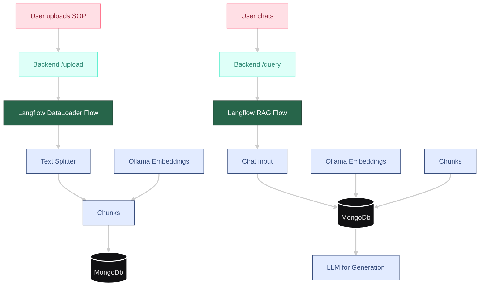

# OT-Service-Support-Assistant

This repository contains a Streamlit-based chatbot designed to assist OT (Operational Technology) service and support teams by answering questions based on a library of Standard Operating Procedure (SOP) documents.

The system uses a RAG (Retrieval-Augmented Generation) pipeline built with [Langflow](https://langflow.org/) to provide accurate, context-aware answers from your private documentation.

## Live Demo

**[Watch the walkthrough on YouTube](https://www.youtube.com/watch?v=cOzdZIjtiKY)**

## Features
- **Conversational UI:** An intuitive chat interface for asking technical questions.
- **Document Upload:** Easily upload and index new SOPs (PDF, DOCX, TXT).
- **RAG Pipeline:** Leverages a powerful backend to retrieve relevant document chunks and generate answers with an LLM.
- **Session Management:** Keeps track of conversation history and uploaded files per session.

## How to Run

1.  **Langflow Backend**
    - Install Langflow & MongoDB driver: `uv pip install langflow pymongo`
    - Start the Langflow server: `uv run langflow run`
    - Import the flow definitions from the `./Langflow/` directory.

2.  **Backend Service**
    - Navigate to the backend: `cd Backend`
    - Install dependencies: `pip install -r requirements.txt`
    - Run the FastAPI server: `uvicorn main:app --reload`

3.  **Frontend UI**
    - Navigate to the frontend: `cd Frontend`
    - Install dependencies: `pip install -r requirements.txt`
    - Run the Streamlit app: `streamlit run app.py`

---
## Architecture Decision Records

Whenever we make a significant architectural choice for this OT-Debug Chatbot, we record it here.

### ADR 0001: Choose Streamlit for User Interface
**Date:** 2025-06-16
**Status:** Accepted

#### Context
We need a lightweight, interactive web UI that allows enterprise users to type in OT system issues and get back suggestions. It should be simple to deploy alongside our backend service.

#### Decision
Use [Streamlit](https://streamlit.io) for the front end.

#### Consequences
- **Pro:** Rapid prototyping, minimal boilerplate, built-in support for chat-style layouts.
- **Con:** Limited custom component flexibility (but acceptable for v1).

### ADR 0002: Use FastAPI as Backend Bridge
**Date:** 2025-06-16
**Status:** Accepted

#### Context
We need a RESTful service to receive queries from the UI and forward requests to the Langflow server's run API.

#### Decision
Implement the backend in Python using [FastAPI](https://fastapi.tiangolo.com).

#### Consequences
- **Pro:** Async support, automatic OpenAPI docs, easy integration with `httpx`.
- **Con:** Adds an extra hop between UI and Langflow (acceptable for decoupling).

### ADR 0003: Use Langflow for RAG
**Date:** 2025-06-16
**Status:** Accepted

#### Context
We have many SOP documents that must be searched and fed to an LLM dynamically. We want to keep document parsing, vector storage, and prompt templating in a single flow.

#### Decision
Utilize a standard Langflow flow, triggered via its API endpoint, that:
1.  Loads & splits SOPs in `./test_SOPs/`
2.  Indexes them in a MongoDB Atlas collection specific to the session
3.  Retrieves top-k chunks at query time
4.  Passes them plus user query into an OpenAI LLM chain

#### Consequences
- **Pro:** All RAG logic lives in one place, easy to modify prompts or retriever parameters.
- **Con:** Requires Langflow server uptime; introduces dependency on Langflow.

### ADR 0004: Vector Store – MongoDB Atlas
**Date:** 2025-06-17
**Status:** Accepted

#### Context
We need a scalable, cloud-native vector store that supports session-specific data isolation for fast similarity searches over our SOP documents. The initial on-disk FAISS approach was not suitable for this.

#### Decision
Use MongoDB Atlas as the vector store. Each user session from Streamlit, identified by its session ID, will correspond to a unique collection. The vector search index will be configured to use cosine similarity.

#### Consequences
- **Pro:** Fully managed service, scales on demand, and provides clear data isolation between user sessions.
- **Con:** Introduces a dependency on MongoDB Atlas and requires network access from the Langflow environment.

### ADR 0005: Google Gemini 2.5 Pro for LLM
**Date:** 2025-06-16
**Status:** Accepted

#### Context
We need a powerful model to interpret SOP context and troubleshoot OT-system issues effectively.

#### Decision
Use `Gemini 2.5 Pro` via Google AI.

#### Consequences
- **Pro:** State-of-the-art reasoning, multimodality, and instruction-following.
- **Con:** Cost per token; dependency on Google Cloud services.

---

(When a new major decision arises—e.g. switching to Chroma, adding caching middleware, or upgrading the UI framework—append a new ADR with a fresh ID and date.)

